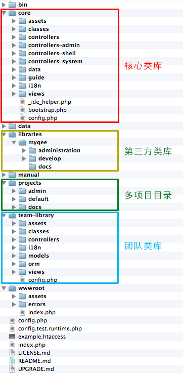

新手入门
------

### 了解MyQEE是如何运行的

当一个URL请求时，通过 `index.php` 载入 `core/bootstrap.php` 文件（这是MyQEE的基础启动类库），然后会根据 `config.php` 里的 `$config['projects']` 项目配置匹配当前URL确定项目，再读取项目相关配置后，根据URI或者是路由设置加载控制器，执行相应的action方法。

### 熟悉MyQEE的文件目录结构

从目录结构上可以看出核心类库中拥有包括类库(`classes`)，控制器(`controllers`)，视图(`views`)等目录，并且在`team-library` 中也拥有类似的目录结构。是的，包括每个项目目录，第三方类库目录都可以拥有相同的目录结构，这些目录结构在php执行时可以进行合并后执行，这就是HMVC。

从上图可以看出，虽然程序实际所在的目录分别放在3个类库目录中，但是在程序执行时，HMVC逻辑就像右侧合并目录后的结果一样，这样我们可以合理的规划代码存放在最合理的地方。

 
系统默认只加载当前项目目录、团队类库和核心类库，并不会加载第三方类库，如果需要加载第三方类库可在`config.php`中配置，具体配置方法可参考 [config.php配置](config.md) 中关于`projects`相关配置说明。

在您下载的MyQEE程序中，有一个`config.new.php`文件，您可以把这个文件直接改名(或复制)为config.php，然后根据自己需求进行简单配置即可。

 
当您已经了解了MyQEE，那么开始来配置您的服务器吧。MyQEE是一个兼容性非常强的的php框架，可运行在各种系统中，包括新浪SAE，百度BAE等云服务器上，站点配置除了要支持php5.2+外，建议开启rewrite功能，相关的设置可参考文档首页的配置说明。

### Hello World

当MyQEE成功配置后，我们来写一个简单的hello world吧。

首先检查根目录的 `config.php` 里 `$config['projects']` 的相关配置是否有default项目，如果没有则创建，内容如下：

    // 请确保Default放在最后
    'default' => array
    (
        'name'      => '默认项目',        //名称
        'dir'       => 'default',        //目录
        'url'       => '/',              //项目根目录
    )

在 `projects/default/controllers/` 目录中建立 `helloworld.controller.php` 文件，内如如下：

    <?php
    class Controller_HelloWorld extends Controller
    {
        public function action_default()
        {
            echo 'hello world';
        }
    }

在页面上打开 `/helloworld` 路径看看是否有输出？如果有输出 `hello world` 恭喜，第一个测试成功了。

**为什么页面显示404错误？**

* 这个404页面是apache/IIS/nginx等输出的？那么说明你的rewrite没有配置正确或没启用，请参照[安装与配置](setup.md)说明进行修改；
* 这个404页面是MyQEE输出的界面？说明rewrite已经配置成功，但是 `config.php` 中项目配置的不正确，检查url部分设置；

### 关于文件后缀和大小写问题

* `classes` 类库文件后缀都为 `.class.php`, 比如 `database.class.php`；
* `controllers` 控制器后缀都为 `.controller.php`, 比如 `index.controller.php`；
* `models` 模块文件后缀都为 `.model.php`， 比如 `member.model.php`；
* `views` 视图文件后缀为 `.view.php`，比如 `index.view.php`；
* `orm` ORM文件后缀为 `.orm.php`，比如 `member.orm.php`；
* `i18n` 语言包文件后缀都为 `.lang`，比如 `zh-cn.lang`；

为何不是 `.php` 而是多了个二级后缀？这是经过多年团队开发实践得出的结论，在实际项目开发中，我们通常会用相同的控制器、模块、视图等，我们发现如果同时编辑这些文件时会很混乱，所以我们在后缀上加以区分，虽然只是一个细节，但是如果你开了几十个标签的php文件，就会发现它是多么体贴。

*（其它目录并没有严格的约束，但是如果自己在项目开发时，可以参考我们的做法）*

!!! V3中所有文件都为小写，V2中是区分大小写的

